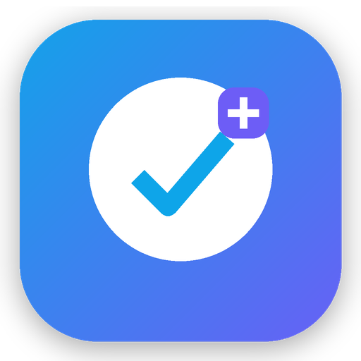

# Habit Dashboard

<p align="center">
  
</p>

**Habit Dashboard** is a Flutter habit tracker for people who want one simple place to build good habits, quit bad ones, and understand their progress over time.

Instead of only showing a basic checklist, the app tracks streaks, skipped days, slips, milestones, weekly goals, reminders, notes, and history. The goal is to make habit tracking feel clear, motivating, and realistic.

## Landing page

The public landing page is inside the `docs/` folder:

```text
docs/index.html
```

To publish it with GitHub Pages:

1. Open the repository on GitHub.
2. Go to **Settings** → **Pages**.
3. Under **Build and deployment**, choose **Deploy from a branch**.
4. Select the `main` branch and the `/docs` folder.
5. Save, then wait for GitHub to create the public page link.

## Visual preview

<p align="center">
  
  
  
</p>

## What the app does

- Create habits for both **building routines** and **quitting bad habits**.
- Mark a habit as done for today, or mark a quit habit as a clean day.
- Track current streaks and best streaks.
- Use skipped/rest days without breaking the streak.
- Log slips for quit habits and keep relapse history separate from normal habit progress.
- Set target days and weekly goals.
- Add notes, icons, colors, and custom uploaded images for habit icons.
- Use smart reminders with selected weekdays, custom reminder text, and incomplete-only reminder logic.
- View history, calendar-style progress, recent activity, and habit insights.
- See XP, rewards, milestone feedback, and progress cards.
- Use the app with or without creating an account.
- Keep data local-first with SharedPreferences, while also supporting Firebase Authentication for accounts.
- Import/export habit data and create restore points.
- Switch between light and dark mode.

## Tech stack

- **Flutter / Dart** for the mobile app UI and app logic.
- **Material 3** for the visual design system.
- **SharedPreferences** for local habit storage and settings.
- **Firebase Core** and **Firebase Authentication** for optional account login/registration.
- **flutter_local_notifications**, **timezone**, and **flutter_timezone** for local reminders.
- **file_picker** for import/export and custom image icon workflows.

## Main project structure

```text
lib/
  app/
    app.dart
    routes.dart
    theme.dart
  core/
    firebase/
    notifications/
    theme/
    utils/
    widgets/
  features/
    about/
    auth/
    habits/
      data/
      domain/
      presentation/
    onboarding/
    settings/
    store/
assets/
  branding/
  privacy_policy.md
docs/
  index.html
  styles.css
  assets/
```

## How to run locally

Make sure Flutter is installed, then run:

```bash
flutter pub get
flutter run
```

For Chrome/web testing:

```bash
flutter run -d chrome
```

For Android release testing:

```bash
flutter build apk --release
```

For a Play Store / closed testing build:

```bash
flutter build appbundle --release
```

## Notes for another developer

The app stores habit data locally under the `habits_v1` key using SharedPreferences. The main habit model is in:

```text
lib/features/habits/domain/habit.dart
```

The main repository logic is in:

```text
lib/features/habits/data/habit_repository.dart
```

Notification syncing is handled from the repository through:

```text
lib/core/notifications/notification_service.dart
```

## Privacy

The app is designed to be local-first. A privacy policy draft is included here:

```text
assets/privacy_policy.md
```

## License

This project is released under the MIT License. See `LICENSE` for details.
